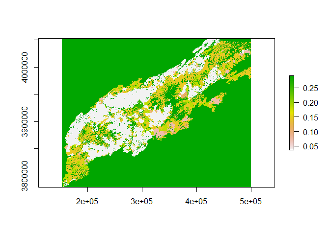

Practice Upload
================
Zjrobbin
6/14/2021

#### Making the Map

##### [Landownership](https://www.fs.usda.gov/rds/archive/Product/RDS-2017-0007)

Citation:

Hewes, Jaketon H.; Butler, Brett J.; Liknes, Greg C. 2017. Forest
ownership in the conterminous United States circa 2014: distribution of
seven ownership types - geospatial dataset. Fort Collins, CO: Forest
Service Research Data Archive. <https://doi.org/10.2737/RDS-2017-0007>

Description:

From the FS Website

This data publication contains 250 meter raster data depicting the
spatial distribution of forest ownership types in the conterminous
United States. The data are a modeled representation of forest land by
ownership type, and include three types of public ownership: federal,
state, and local; three types of private: family (includes individuals
and families), corporate, and other private (includes conservation and
natural resource organizations, and unincorporated partnerships and
associations); as well as Native American tribal lands. The most
up-to-date data available were used in creating this data publication.

A plurality of the ownership data were from 2014, but some data were as
old as 2004.

``` r
library(raster)
```

    ## Loading required package: sp

``` r
Own<-raster("C:/Users/zacha/Desktop/Harvest_Validator/Ownership_Resampled.tif")
```

    ## Warning in showSRID(uprojargs, format = "PROJ", multiline = "NO"): Discarded datum Unknown based on GRS80 ellipsoid in CRS definition,
    ##  but +towgs84= values preserved

``` r
plot(Own)
```

<!-- -->

#### Normalizing by day and area

``` r
Own[Own$Ownership_Resampled,]<-Own[Own$Ownership_Resampled,]*365/10000
plot(Own)
```

<!-- -->
